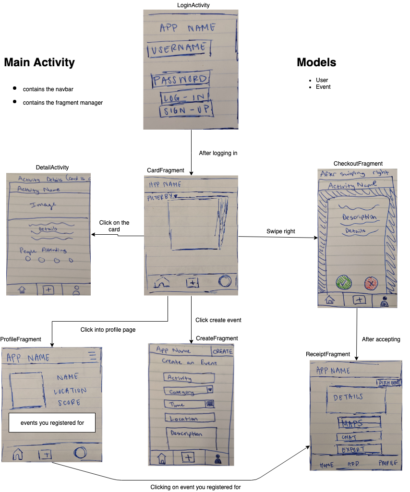

Activity Tinder - README
===

## Table of Contents
1. [Overview](#Overview)
1. [Product Spec](#Product-Spec)
1. [Wireframes](#Wireframes)
2. [Schema](#Schema)
3. [Todo](#Todo)

## Overview
### Description
Have you ever wanted to hang out with a group of friends, but have no idea what do to? Do you have no friends, but want to do something?

This app will help individuals meet people that they want to hang out or do specific activities with. It will allow them to specify what activity they want to do and find a group or join a group that already plans on doing that activity.

### [App Evaluation](https://courses.codepath.com/courses/android_university_fast_track/pages/app_brainstorming_guide)
[Evaluation of your app across the following attributes]
- **Category:**
    - social, meeting people irl (literally Tinder for friends)
- **Mobile:**
    - it's very convenient on the phone
    - most popular messenger apps are all for mobile
    - good for traveling
    - FB Messenger
    - Google Maps
- **Story:**
    - It orginally started off as solving the FB BFF issue, but quickly expaneded to being able to be used in other enterprises
    - can easily expand to general tech consumers who want to get out and do stuff and meet new people
    - Tinder for people who don't want to go out on dates, but want to have a (platonic) good time
- **Market:**
    - Facebook employees (initially)
    - The general public looking to have a platonic good time
- **Habit:**
    - Aveage user can create an event twice or three times a month
        - But coming back to the app to plan the event would be customized based on when the user joined the activity group and how frequently the gorup corresponds
    - user can decide how often they want to go out
    - if they already have a group that they just want to easily plan outings with, they can visit often whenever the group wnts to go out
- **Scope:**
    - it hopefully can be done
    - biggest issue seems to be what to add as required stories
        - could easily expand and lose focus on the main core of the app

## Product Spec

### 1. User Stories (Required and Optional)

**\*Updated\* Required Must-have Stories**
* [ ] App Icon
* [x] Login/Signup page
* [x] Location permissions
* [x] Event creation page
* [x] Main card stack page with activities on the cards
* [ ] Activity detail page
* [x] Activity checkout page
* [x] Activity receipt page
* [x] Contact us page
* [x] profile page
* [x] separate signup page

**\*Updated\* Stretch Stories** 
* [ ] color categorized cards for the activities depending on the type of activity
* [ ] location page that asks for city location & Directions to event
* [ ] type in password to confirm leaving activity
   * [ ] warning for user before leaving activity under 24 hours before activity
* [ ] detailed card view features:
    * [ ] listing of people who are planning on attending already
    * [ ] default images for types of activities
* [ ] Filter option where you can choose location, price, number of people, etc.
* [ ] Messenger (intent) chat option
* [ ] export event details to calendar
* [ ] checking into event (attendance)

**Optional Nice-to-have Stories**
* organizer can compose a message to be displayed to whoever tries to join the event
*  delete an event
* After-event survey where you are able to rate the people who went
    * You can add pictures of the event to the survey
* cute sound and animation of adding to an event
    * toast
* Help page where it describes what the app does
* profile page features:
    * can see person's past events and photos they took there
* Messenger link in profile picture
* transfer ownership of events
* Optional invite-only events

### 2. Screen Archetypes
https://guides.codepath.org/android/Mobile-Screen-Archetypes
* Login page/register
   * Login page
* Card swiping
   * Swiping for Activities
* creation page
    * allows users to create events  
* Profile Page
    * Where it says the event that you went to 
    * Rating - where you receive stars based on your performance
* Contact us

# 3. Navigation

**Tab Navigation** (Tab to Screen)
Navbar on the bottom of the screen for switching between activities
* Home tab
* Create event
* Profile page

**Flow Navigation** (Screen to Screen)

* Home card deck with activities
   * click on specific card to see that activity's details in a separate activity
   * ...
* Profile
   * click on settings button to access settings
   * ...

## Wireframes

### [BONUS] Digital Wireframes & Mockups

## Schema 
### Models
#### User

   | Property      | Type     | Description |
   | ------------- | -------- | ------------|
   | username      | String   | unique id for the user post (default field) |
   | password      | String   | user's unique password (default field) |
   | name          | String   | user's real name |
   | profileImage  | File     | a photo of the user |
   | dateOfBirth   | DateTime | user's birthdate |
   | email         | String   | image caption by author |
   | reliabilityScore | Number   | score representing how consistently the user shows up for events |
   | email         | String   | user's email address |
   | location      | String   | user's city/general area |
   | activeEvents  | Array of Activities | events the user plans to attend|
   | pastEvents    | Array of Activities | events the user has attended|
   | scoreList     | Array of ints | scores the user has received in events they have signed up for|
   
#### Activity post
| Property      | Type     | Description |
   | ------------- | -------- | ------------|
   | Name      | String   | activity title |
   | User      | Pointer to Object   | user who created the post |
   | Description        | String | description of the activity |
   | Time & Date         |   DateTime  | regarding the when for the event |
   | Category       | String   | type of activity |
   | CreatedAt     | DateTime | date when post is created (default field) |
   | UpdatedAt     | DateTime | date when post is last updated (default field) |
   | Location     | String | place of the activity |
   | People Limit     | Integer | max amount of people that can join the activity |
   | usersAttending  | Array | list of users attending event |
   
### Networking
| Screen      | Endpoint | Property     | Description |
| ----------- | -------- | ------------ | ------------|
| Login/Signup | Parse | username, password | user verification |
| Main Page (stack) | Parse | Activity: name, user who posted, date, location, category, # of people currently attending | basic info about activity |
| Detailed View | Parse | Activity post + description, more details than ^ | detailed info about activity |
| Confirmation page | Parse | Activity post, description | detailed info about activity |
| Profile | Parse | User info | detailed info about the user |
| Receipt page | Parse | Activity post, delete from User's activeList | detailed info about activity |
| Receipt page | Google Maps API | User location, Activity location | directions |
| Receipt page | Calendar | export calendar (intent?) | time info |
| Create Activity | Parse | write to new Activity object | creating activity post |

##	Todo before App Kickoff
- find scope of project
    - break up into features
    - try to cut features into what it needs
- need tasks and goals for every individual person
- want goals per week, per person
    - make the workflow modular
    - avoid blockers/dependencies
